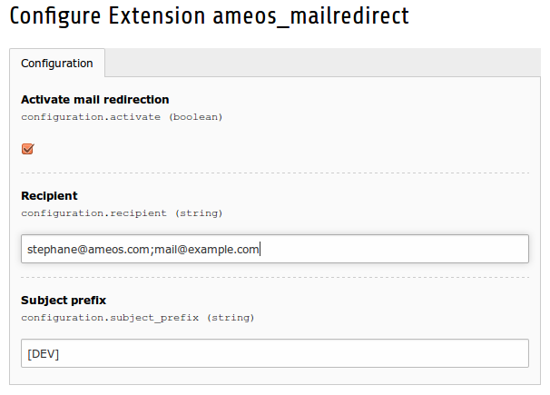

How use it
==========

In the extension manager, you can activate or not the mail redirection.

You can add address email for redirection. Address email must be separate by the character **;**

If you want, you can prefix the mail subject.

